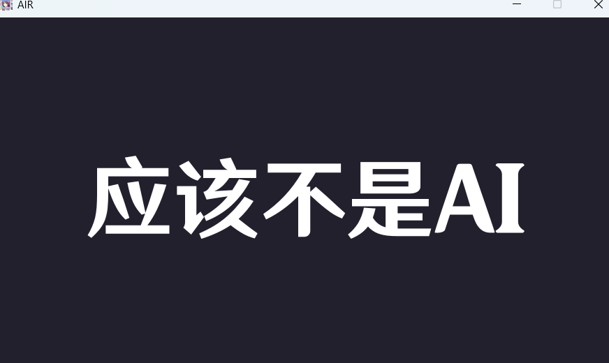

# AIR - AI-Image-Recognizer

<small>by 王昱蘅 钱葭露</small>

## 项目简介

**AIR (AI-Image-Recognizer)** 是一个基于生成对抗网络 (GAN) 技术的工具，用于判断图片是否为人工智能生成。该工具提取并使用生成器部分，通过对图像特征的分析和识别，判断图像是由AI生成还是自然拍摄。我们的目标是为用户提供一种高效、准确且便捷的图像生成识别工具。

## 项目作用

我们希望能用这个项目证明一点：

AI无法代替人，AI自己就如此告诉我们，AI和人有可以分辨的差别

该项目在网络安全，版权保护等地方也可以有应用

## 项目特点

- **用魔法打败魔法**：采用生成对抗网络 (GAN) 进行训练，用生成的`.pth`文件识别AI。
- **UI美观**：我们有非常有趣的UI，具体请自行下载项目体验。

## 依赖与其他项目

我们使用的依赖有：

* torch
* torchvision
* matplotlib
* Pillow

其他项目:

* UI修改自王昱蘅（GitHub：https://github.com/enderman-teleporting ）的[Generator项目]([Enderman-Teleporting/Generator: 随机学号抽卡(原神版) (github.com)](https://github.com/Enderman-Teleporting/Generator))

* 参考了https://blog.csdn.net/Eyesleft_being/article/details/132043605

## 使用方式

1. **下载**：下载我们`Release`s中的最新发布以及该项目根目录的`GAN.py`，pip以上提及的库
2. **训练**：将`GAN.py`中151行`root="..."`修改为你的数据集路径，你还可以根据需要调整`batch_size`（见源码）
3. **整合**：结果在result文件夹中，你会看到很多文件夹，每个文件夹中都有`fake.png`（生成器生成的图片）和`model.pth`（判别器模型）两个文件，每个文件夹代表的训练轮数不同。请挑选最合适的取它的`model.pth`，放入解压出的`Releases`文件夹根目录中
4. **运行**：双击`AIR.exe`运行

## 效果（使用[这个数据集](https://github.com/jayleicn/animeGAN)）

训练数据集（110000+图片）15轮（弱爆了）

检测以下图：

这张图来源于数据集

（流光划过动画就不截了）

这是正确的

而对于和

分别返回大概率是AI（金）和疑似AI（紫）

